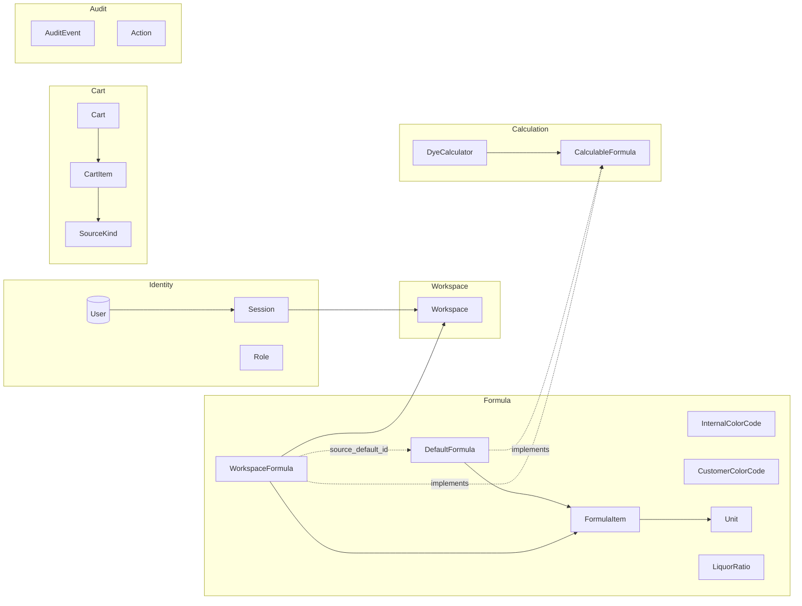

<p align="center">
  
</p>

<h1 align="center">染谱 Ranpu</h1>
<p align="center"><i>DYE FORMULA</i></p>
<p align="center">Windows 离线染纱配色软件 · DDD + Hexagonal · Tauri 2 + React + Rust + SQLCipher</p>

---

## 它是什么

染谱是面向印染车间的**离线**配方管理 + 染料计算软件。所有数据本地加密存储（SQLCipher + Windows DPAPI），不需要联网，不上传任何信息。

核心场景：

- 客户给一个色号（内部色号或客户色号）+ 目标纤维 kg 数 → 立刻得出每种染料的克数。
- 一次性把多条配方放进购物车 → 导出一张批次单（CSV / PDF）给操作工。
- admin 维护「默认配方库」（全局共享）+ 各「工作区」（按客户/项目隔离）的专属配方。
- 普通用户只读、能加车、能计算，不能改配方。

---

## 领域模型



详细的限界上下文与不变量见 [`PROMPT.md`](PROMPT.md) 第 91–142 行。

---

## 各层职责

```
src-tauri/src/
├── domain/         零外部依赖（仅 std + chrono + thiserror + uuid）
│                   值对象 / 聚合 / 领域服务，全部业务规则都在这里
├── application/    定义 ports (trait) + 编排 use case
│   ├── ports/      仓储 + 加密 + 时钟 + 会话存储等抽象 trait
│   └── {context}/  IdentityService / WorkspaceService / FormulaService /
│                   CalculationService / CartService / BackupService / AuditService
├── infrastructure/ 实现 application 中的 ports（adapters）
│   ├── persistence/sqlcipher/    rusqlite + SQLCipher 仓储 + schema.sql
│   ├── crypto/                   argon2 + DPAPI + PBKDF2 + AES-GCM
│   ├── session/                  内存 SessionStore
│   ├── export/                   CSV 导出器
│   └── clock_system.rs           SystemClock (Utc::now)
├── interfaces/tauri/  Tauri 命令薄层 + DTO + 错误映射 + composition root
└── lib.rs / main.rs
```

依赖方向：`interfaces → application → domain ← infrastructure → application → domain`。
domain 永远不知道任何上层，infrastructure 永远不被 application 直接 import。

前端：

```
src/
├── api/         Tauri invoke 客户端，每个上下文一个文件
├── components/  通用组件 (RanpuLogo / TopBar / LockOverlay / FormulaCard / FormulaEditor / IdleDetector / WorkspaceSwitcher)
│   └── ui/      shadcn/ui 基础组件
├── pages/       每个路由一个 .tsx
├── store/       zustand (session + settings)
├── lib/         格式化工具
└── App.tsx      启动门 (boot gate) + 路由
```

---

## 本地开发

> 需要：Node 18+ / npm 9+，Rust stable（首次会编译 SQLCipher + OpenSSL，约 1 分钟）。

```bash
git clone https://github.com/Leon-bo-He/Ranpu.git
cd Ranpu

# 前端依赖
npm install

# 后端依赖会在第一次 cargo check 时下载
npm run tauri dev   # 启动开发模式（自动开热更新）
```

常用脚本：

```bash
npm run typecheck   # tsc --noEmit
npm run lint        # eslint --max-warnings 0
npm run format      # prettier --write
npm run tauri dev   # 桌面应用开发模式
npm run tauri build # 打包成 .msi/.exe（需要 Windows 主机）
```

后端：

```bash
cargo test  --manifest-path src-tauri/Cargo.toml
cargo clippy --all-targets --manifest-path src-tauri/Cargo.toml -- -D warnings
```

---

## 打包发布

```bash
npm run tauri build
```

输出：`src-tauri/target/release/bundle/msi/染谱_<version>_x64_zh-CN.msi`（Windows 主机上）。

> 在 macOS/Linux 主机上 `tauri build` 会生成对应平台的产物，但项目目标平台是 Windows，DPAPI 仅在 Windows 上做真正的密钥保护；其它平台用一个明文 fallback（仅用于本地开发）。

图标重新生成：

```bash
npm run tauri -- icon src-tauri/icons/source-logo.svg
```

---

## 首次启动流程

1. 双击 `染谱.exe` → 应用检测到 `%APPDATA%\Ranpu\keystore.bin` 不存在 → 引导到「首次启动设置」页。
2. 用户设置 **启动口令**（≥ 8 位）+ **管理员用户名 / 密码**。
3. 后端：
   1. 用 `OsRng` 生成 32 字节主密钥 → DPAPI 保护后写入 `keystore.bin`。
   2. PBKDF2-SHA256(主密钥 + 启动口令, 600k 轮) 派生出 SQLCipher 的 64 hex 密钥。
   3. 创建 `ranpu.db`，跑 `schema.sql`，跑 seed（3 个示例 workspace + 5 条示例 default 配方）。
   4. argon2id 哈希 admin 密码，写入 `users` 表。
   5. 自动登录，进入主面板。
4. 之后每次开启：用户输入启动口令 → 派生密钥 → 解锁 DB → Login 页。

启动口令错误时，后端检测 SQLCipher 「file is encrypted or is not a database」错误，返回 `boot_passphrase_incorrect`，UI 显示「启动口令不正确」。

---

## 加密设计 — 审计要点

- **主密钥**：32 字节随机，仅在内存与 DPAPI 保护的 `keystore.bin` 之间流转；从不写明文磁盘，从不写日志。
- **数据库密钥**：`PBKDF2-SHA256(主密钥 ‖ 启动口令, salt="ranpu-db-key", 600 000 轮)` → 32 字节 → 64 hex → `PRAGMA key`。每次启动重新派生，不缓存。
- **密码哈希**：argon2id，`Argon2::default()` 参数（m=19MiB, t=2, p=1）+ `OsRng` salt。`PasswordHash::Display` 故意输出 `<password-hash:redacted>` 防误打印。
- **`.ydaexp` 备份/审计导出**：
  - 文件头：`MAGIC(4)='YDA1' | VERSION(1) | SALT(16) | NONCE(12) | 密文+TAG`
  - PBKDF2-SHA256(导出口令, salt, 600 000 轮) → 32 字节 AES key
  - AES-256-GCM，AAD = MAGIC
  - 错口令 → `decrypt` 返回 `WrongPassphrase`（区别于 `Format` 文件损坏）。
- **会话**：仅内存。锁屏不写磁盘；连续 5 次解锁失败强制登出。
- **审计**：每个 use case 写一笔，包含 user_id / workspace_id / action / target / details / RFC3339 时间戳。审计导出有「明文 CSV 二次确认」弹窗。

第三方审计建议：

1. 比对 `infrastructure/crypto/` 与 `application/ports/` 中的 trait/impl 配对。
2. `grep` 检查 `password` 字符串不被序列化或直接 println。
3. 在 fuzz 测试中检验 `.ydaexp` 文件头解析的健壮性。
4. 用 `cargo audit` 跟踪 RustSec 公告。

---

## 快捷键

UI 暂未自定义快捷键。系统级：

- `Ctrl+W` / `⌘W` — 关闭窗口（操作系统行为）
- 自动锁屏：默认 10 分钟无活动；可在「设置」改为 5 / 30 / 60 分钟或关闭。
- 顶栏「锁定」按钮立即锁屏，会话状态保留。

---

## Git 分支策略

零号步骤（已完成）：`git init` → `main` → `chore: initialize repository`。

后续每条特性走独立 `feat/<name>` 分支，`--no-ff` 合并保留分支历史：

```text
main
 ├── feat/initial-scaffold     ✓
 ├── feat/domain-layer         ✓
 ├── feat/application-ports    ✓
 ├── feat/infra-persistence    ✓
 ├── feat/infra-crypto         ✓
 ├── feat/interfaces-tauri     ✓
 ├── feat/ui-design-system     ✓
 ├── feat/ui-identity          ✓
 ├── feat/ui-formula           ✓
 ├── feat/ui-admin             ✓
 └── feat/seed-and-polish      ✓
```

Conventional Commits：`feat(domain)` / `chore(scaffold)` / `fix(ui)` / `refactor(repo)` / `test(calc)` / `docs` 等。

不在 `main` 直接提交（除零号 commit 与本说明文件等元更新）。

---

## License

暂未定 License；如需商业使用请先联系作者。

---

## 致谢

- [Tauri](https://v2.tauri.app/) — 桌面壳
- [shadcn/ui](https://ui.shadcn.com/) — UI 组件设计语言
- [SQLCipher](https://www.zetetic.net/sqlcipher/) — SQLite 加密引擎
- [argon2](https://github.com/RustCrypto/password-hashes) / [aes-gcm](https://github.com/RustCrypto/AEADs) — RustCrypto
